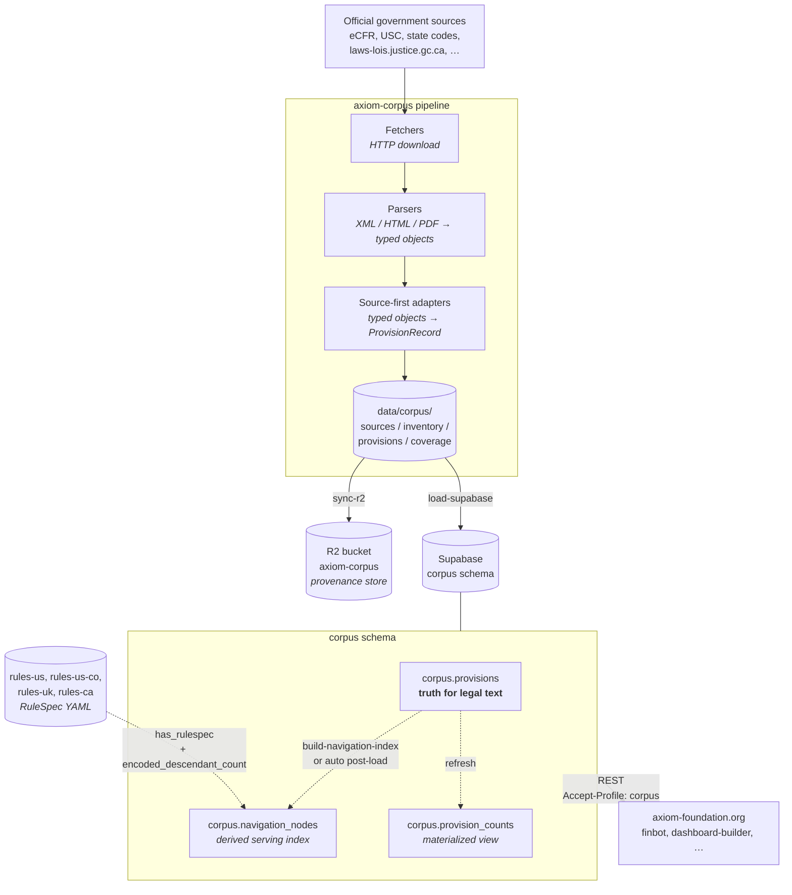
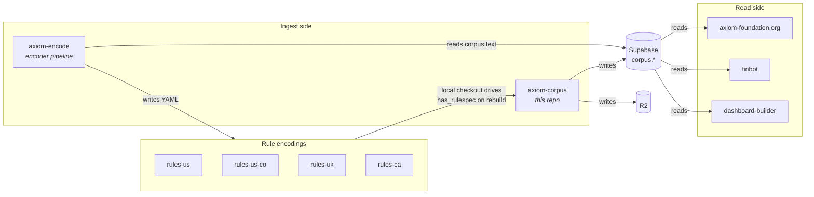
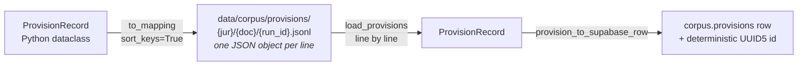
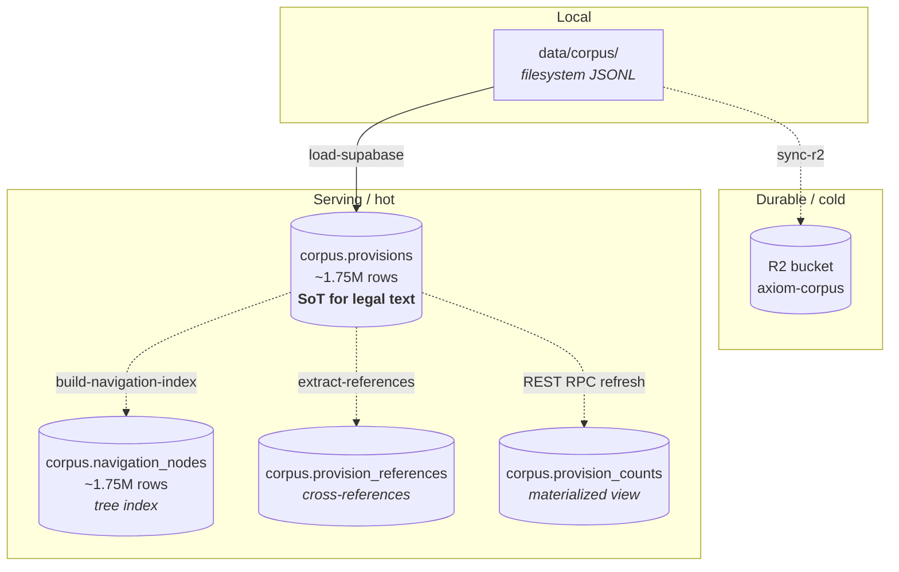
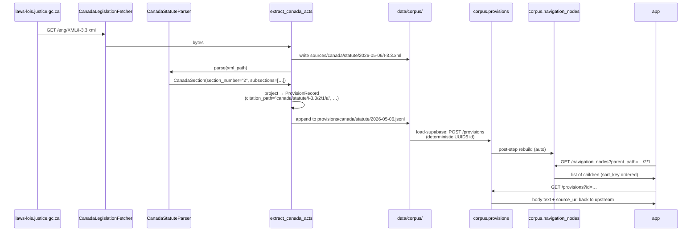
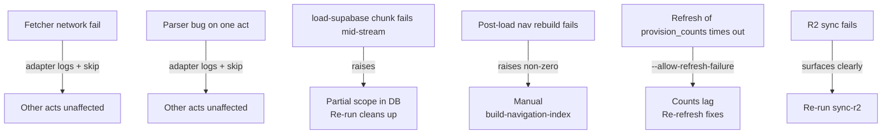

# Architecture Overview

A visual map of how `axiom-corpus` works end to end. Sibling docs zoom in
([corpus-pipeline.md](../corpus-pipeline.md),
[source-organization.md](source-organization.md)); this one is the picture
you point at to explain the whole thing.

> **Interactive version:** an explorable React app lives in
> [`docs/architecture-viewer/`](../architecture-viewer/). Run
> `cd docs/architecture-viewer && npm install && npm run dev` and open
> <http://localhost:5179>. Click any node to read what it owns and how it
> connects.

## The Big Picture



Three flows, three colors of arrow:

- **Solid:** the ingest path that produces source-of-truth data.
- **Dotted:** derivations from that source — nav rebuilds, materialized
  views, encoded coverage.
- **One-way out:** apps read; they never write back.

## Repository Boundaries



Hard rules across the boundary:

- `axiom-corpus` owns source text (`corpus.provisions`) and the derived
  serving index (`corpus.navigation_nodes`).
- `rules-*` repos own RuleSpec YAML encodings. Their existence is observed
  by the navigation builder; they are never authoritative for legal text.
- `axiom-encode` reads corpus text and writes YAML; never the other way.
- Apps are read-only consumers via PostgREST.

## The Five Pipeline Stages

```text
   ┌────────┐    ┌────────┐    ┌─────────┐    ┌──────────┐    ┌──────────┐
   │ FETCH  │ →  │ PARSE  │ →  │ ADAPT   │ →  │ STORE    │ →  │ PUBLISH  │
   └────────┘    └────────┘    └─────────┘    └──────────┘    └──────────┘
   raw bytes     typed         Provision      JSONL on        R2 +
   from HTTP     domain        Record +       disk under      Supabase
                 models        Inventory      data/corpus/    corpus.*
                               Item

   src/.../      src/.../      src/axiom_corpus/corpus/{adapter}.py
   fetchers/     parsers/
                                              CorpusArtifactStore
```

Each stage is responsible for one thing. The shape that crosses every
boundary is `ProvisionRecord` (in code) and the JSONL line (on disk and
in R2).

## On-Disk Artifact Layout

```text
data/corpus/
├── sources/
│   └── canada/statute/2026-05-06/
│       └── I-3.3.xml                    ← raw upstream bytes (sha256 tracked)
├── inventory/
│   └── canada/statute/2026-05-06.json   ← expected citation paths
├── provisions/
│   └── canada/statute/2026-05-06.jsonl  ← one ProvisionRecord per line
└── coverage/
    └── canada/statute/2026-05-06.json   ← inventory vs provisions diff
```

The same key structure mirrors into the `axiom-corpus` R2 bucket.

## The JSONL Contract



Required keys: `jurisdiction`, `document_class`, `citation_path`.
Everything else is optional and emitted only when non-null.

## Citation Path Convention

```text
canonical citation_path  =  {jurisdiction}/{document_class}/{path_segments…}

      jurisdiction ──┐                ┌── doc_class
                     │                │
                     ▼                ▼
              canada / statute / I-3.3 / 2 / 1 / a
                                  │     │   │   │
                       act code ──┘     │   │   │
                       section number ──┘   │   │
                       subsection label ────┘   │
                       paragraph label ─────────┘
```

Same shape for every jurisdiction:

| Jurisdiction | Example path | Notes |
|---|---|---|
| us | `us/statute/26/3111/a` | USC title / section / subsection |
| us | `us/regulation/7/273/7` | CFR title / part / section (no `-cfr` suffix) |
| us-co | `us-co/regulation/10-ccr-2506-1/4.306.1` | preserves CCR publication number |
| us-co | `us-co/policy/cdhs/snap/fy-2026-benefit-calculation` | policy under cdhs publisher |
| canada | `canada/statute/I-3.3/2/1/a` | act / section / subsection / paragraph |

`citation_path` is the canonical identifier; the row's UUID5 id is
deterministic from it.

## Storage Layers



Which layer can you rebuild from?

| Loss | Recoverable from |
|---|---|
| `corpus.navigation_nodes` deleted | `corpus.provisions` (`build-navigation-index --all --from-supabase`) |
| `corpus.provisions` deleted | local JSONL or R2 (`load-supabase`) |
| local `data/corpus/` deleted | R2 (pull) or full re-extract |
| R2 contents deleted | full re-extract from upstream |
| Upstream sources change | nothing — we snapshot, but no time machine for the source |

## A Single Provision's Journey

Tracing `canada/statute/I-3.3/2/1/a` from upstream to app.



## CLI Surface

```mermaid
flowchart LR
    subgraph EXTRACT[Extract: produce JSONL]
        E1[extract-ecfr]
        E2[extract-usc]
        E3[extract-state-statutes]
        E4[extract-canada-acts]
        E5[extract-indiana-code]
        E6[extract-colorado-ccr]
        EX[extract-…]
    end

    subgraph PUBLISH[Publish: push JSONL outward]
        S1[sync-r2]
        L1[load-supabase]
        B1[build-navigation-index]
    end

    subgraph INSPECT[Inspect: report]
        C1[coverage]
        A1[analytics]
        V1[validate-release]
        SC[snapshot-provision-counts]
    end

    EXTRACT --> PUBLISH
    PUBLISH --> INSPECT
```



The typical operator flow for a new ingest:

```text
extract-{adapter} → sync-r2 → load-supabase → (auto) build-navigation-index
                                                       │
                                          coverage / analytics / validate-release
```

## Failure Surfaces



Loud failures everywhere by default; opt-in escape hatches
(`--allow-incomplete`, `--allow-refresh-failure`, `--no-build-navigation`)
for known transient cases.

## What's Outside This Diagram

- **`axiom-encode`** — encoder pipeline. Reads `corpus.provisions`, writes RuleSpec YAML into `rules-*` repos. Not part of this repo's ingest path.
- **App-side rendering, search, AI assistants** — `axiom-foundation.org` and downstream demos. They read this corpus; they don't shape it.
- **RuleSpec compiler / runtime** — separate stack that turns YAML into runnable benefit calculations. Anchors on citation paths but doesn't write here.

## See Also

- [corpus-pipeline.md](../corpus-pipeline.md) — pipeline contract in prose
- [source-organization.md](source-organization.md) — repo split & artifact layout
- [STATE_SCRAPERS.md](../STATE_SCRAPERS.md) — per-state adapter notes
- [agent-ingestion-runbook.md](../agent-ingestion-runbook.md) — operator runbook
